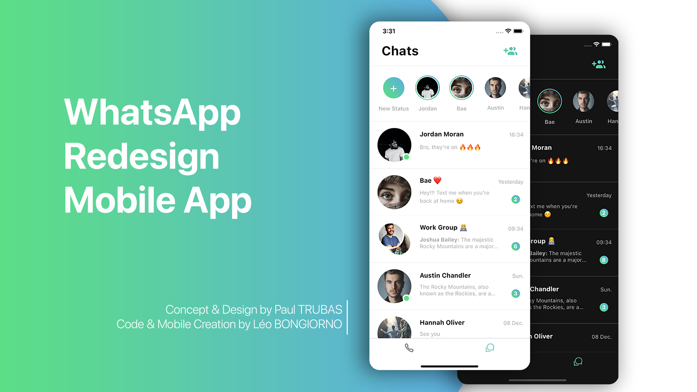
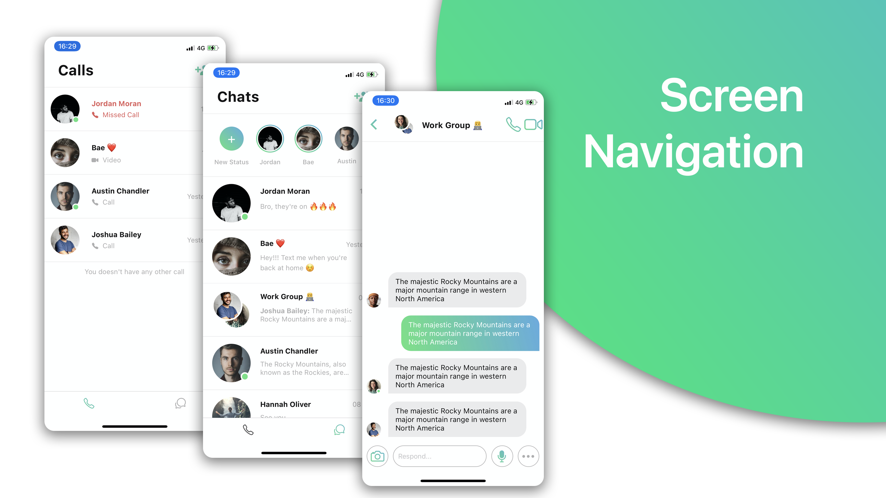
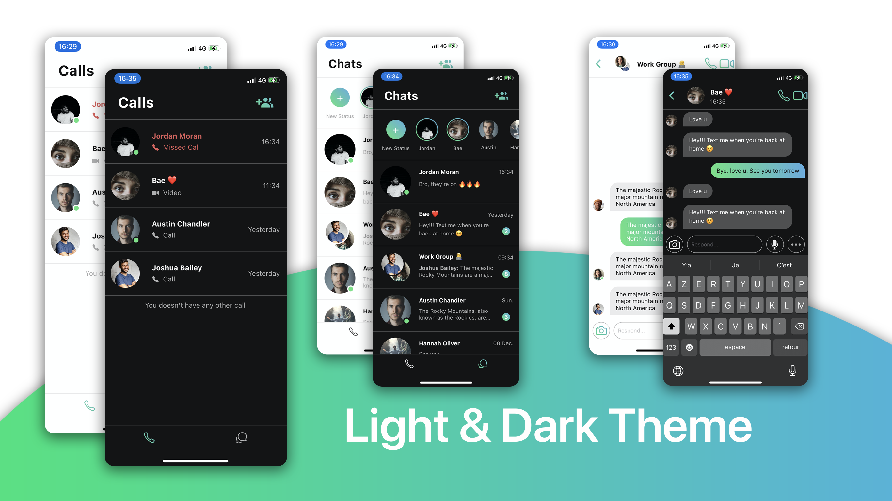
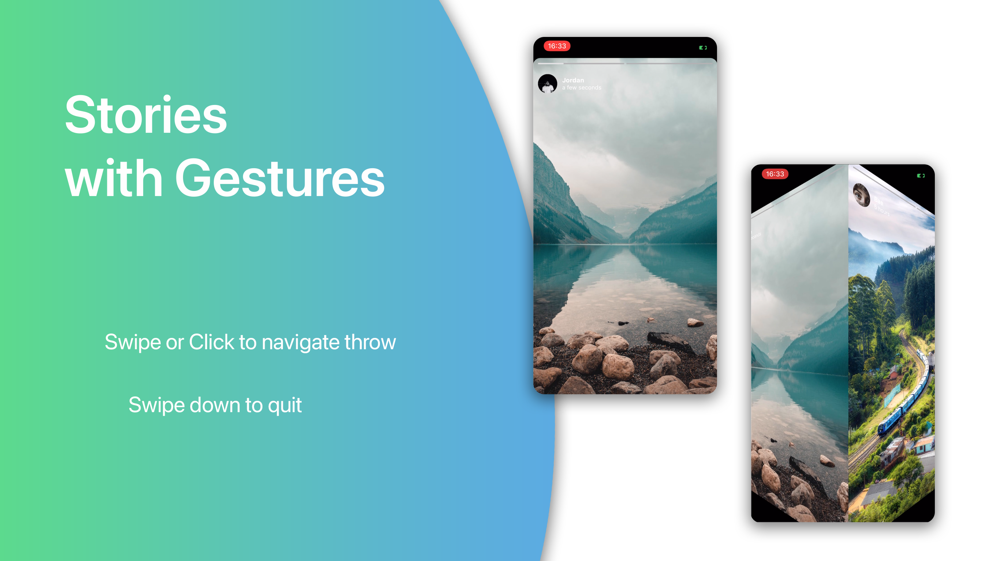
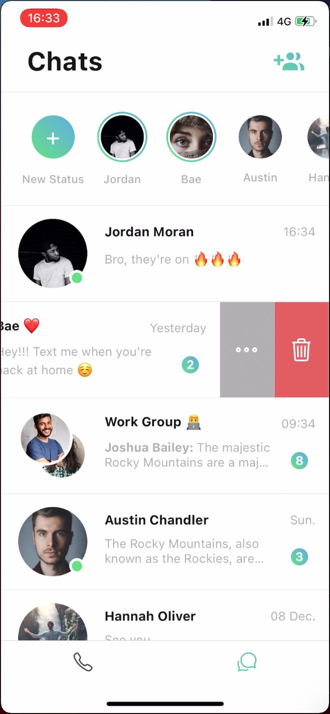

# WhatsApp Redesign Mobile App

En utilisant le design d'une application, je voulais m'entraîner et me se former sur React Native. J'ai utilisé le design créé par Paul TRUBAS, disponible [ici](https://www.behance.net/gallery/86147197/Whatsapp-Redesign-Concept), trouvé sur Behance. Trouvant l'application WhatsApp officielle vieillissante face à ces concurrents, j'ai tout de suite accroché au projet. J'ai codé l'application, grâce au design, en me focalisant sur la partie React Native et donc visuelle, elle n'est donc évidemment pas utilisable en tant que messagerie.

## Fonctionnalités 

### Screen Navigation

Une navigation entre écran classique réalisé grâce à [***React Navigation***](https://reactnavigation.org/), et notamment grâce aux composants :
- ***Bottom Tab Navigator*** : Pour passer entre l'écran des conversations et l'écran des appels, grâce à une barre en bas de l'écran.
- ***Stack Navigator*** : Pour passer de l'écran des conversations aux écrans avec les messages, pour les lire et y répondre.

### Light / Dark Theme

La gestion des thèmes *Light* et *Dark* est présente grâce à *React Navigation* et *React Native Apparence*. Les couleurs s'adaptent au thème du smartphone.

### Stories & Gestures

Grâce au ***PanResponder*** de ***React Native***, l'application intègre un système de Stories, semblabe à ***Intagram***. Le *PanResponder* permet de gérer tous les mouvements et clic de l'utilisateur afin de générer des actions et des animations.
Ainsi, le swipe horizontalement ou le clic pour changer de stories fonctionne. Le Swipe vers le bas quitte les stories.
En plus de cela, un timer permet de changer de stories automatiques au bout de 5 secondes.

### Swipeable 

Grâce à ***React Native Gesture Handler***, il est possible d'ajouter les boutons d'options affichable grâce à un swipe à gauche sur les conversations. Plus d'information [ici](https://docs.swmansion.com/react-native-gesture-handler/docs/component-swipeable/)

## GIFs

## Credits

You will find the original design made by Paul TRUBAS here : https://www.behance.net/gallery/86147197/Whatsapp-Redesign-Concept